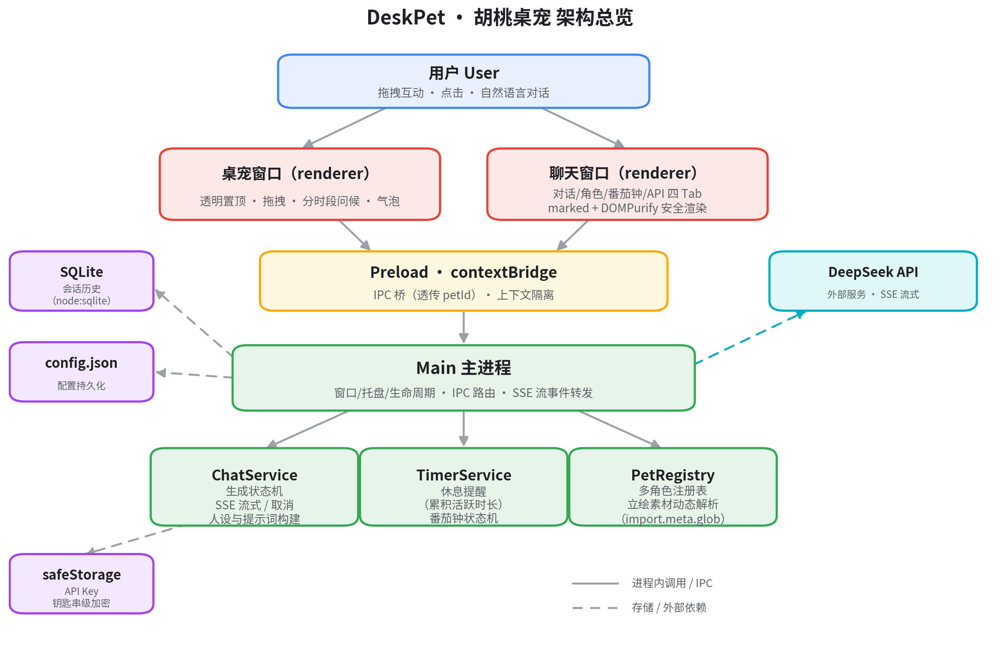

# 二次元桌宠 · Desktop-pet

[](https://github.com/zhenkun26/Desktop-pet/actions/workflows/ci.yml)
[](LICENSE)
[](https://www.electronjs.org/)
[](https://www.typescriptlang.org/)
[](https://www.apple.com/macos/)
[](openspec/)
[](docs/ADVERSARIAL_REVIEW_REPORT.md)

> **中文**:一个 Electron 二次元桌宠陪伴应用:以角色形象呈现的透明置顶桌宠,支持拖拽互动、AI 角色扮演对话、休息提醒与番茄钟;当前内置角色为胡桃,并预留多角色扩展框架(见「新增桌宠 / Adding a New Pet」)。
>
> **EN**: An Electron anime-style desktop pet companion: a transparent always-on-top pet with drag-and-drop, AI roleplay chat, rest reminders and a Pomodoro timer. It currently ships with Hutao and includes a ready multi-character framework (see "Adding a New Pet").

> ⚠️ **NOTICE / 版权声明**:胡桃立绘、角色形象等美术资源版权归 miHoYo(米哈游)所有,仅限个人学习与交流,请勿商用或二次分发;商用请替换为自有素材。 / Art assets such as the Hutao artwork are copyrighted by miHoYo and provided for personal learning only; replace them for commercial use.

## 功能 / Features

- 🐱 **桌面宠物 / Desktop Pet**:透明置顶窗口,可拖拽/点击互动,分时段问候,气泡与思考动画 / Transparent always-on-top window, draggable & clickable, time-based greetings, speech bubbles and thinking animation
- 💬 **AI 角色对话 / AI Character Chat**:DeepSeek 驱动的角色扮演,SSE 流式输出,会话历史与角色设定自定义 / DeepSeek-driven roleplay with SSE streaming, conversation history and customizable persona
- ⏰ **陪伴工具 / Companion Tools**:休息提醒(累积活跃时长)+ 番茄钟(工作/休息状态机) / Rest reminders (accumulated active time) + Pomodoro (work/break state machine)

## 技术栈 / Tech Stack

- Electron 39 + TypeScript 5.7(strict)
- electron-vite 2:main / preload / renderer 三端构建 / three-target build
- DeepSeek API:SSE 流式对话 / streaming chat
- node:sqlite:Electron 内置,零原生依赖 / built-in, zero native dependencies
- marked + DOMPurify:Markdown 安全渲染 / safe Markdown rendering

## 架构总览 / Architecture



**中文**:Electron 三进程结构:renderer(桌宠窗口 + 聊天窗口)经 preload 的 contextBridge 与 main 主进程通信;主进程承载 ChatService(SSE 流式对话)、TimerService(休息提醒 + 番茄钟)与 PetRegistry(多角色框架),本地持久化使用 node:sqlite 与 safeStorage 钥匙串级加密。

**EN**: Three-process Electron architecture: renderer (pet window + chat window) talks to main via preload's contextBridge; main hosts ChatService (SSE chat), TimerService (rest reminder + Pomodoro) and PetRegistry (multi-character framework); persistence uses node:sqlite and safeStorage keychain-level encryption.

## 快速开始 / Quick Start

```bash
npm install
npm run dev
```

首次使用请在聊天窗口的「API」页配置 DeepSeek API Key(系统钥匙串级加密保存)。/ On first use, configure a DeepSeek API Key in the "API" tab (stored with OS keychain-level encryption).

## 开发 / Development

```bash
npm run dev        # 开发模式 / dev mode
npm run build      # 构建到 out/ / build to out/
npm test           # 单元测试(vitest)/ unit tests
npm run build:mac  # 打包 macOS dmg / package macOS dmg
```

> 国内网络可自行配置 electron 镜像(如 `electron_mirror`),请勿提交个人镜像配置。 / China users may configure electron mirrors locally (e.g. `electron_mirror`); never commit personal mirror config.

## Contents / 项目结构

> 完整 tree(排除 `node_modules/`、`out/`、`release/`、`dist/`、`coverage/` 等生成目录);行尾注释 中文 | English。 / Full tree (generated dirs excluded); comments are 中文 | English.

```
Desktop-pet/
├── .github/                          # GitHub 治理:CI、发版、模板 / governance: CI, release, templates
│   ├── workflows/
│   │   ├── ci.yml                    # CI:typecheck + build + test + gitleaks
│   │   └── release-mac.yml           # 手动触发 dmg 发版 / manual dmg release
│   ├── CODEOWNERS                    # 审查负责人 / code review owners
│   ├── PULL_REQUEST_TEMPLATE.md      # PR 模板 / PR template
│   ├── ruleset-main.json             # main 分支保护规则 / main branch ruleset
│   └── ISSUE_TEMPLATE/               # issue 模板 / issue templates
├── .codex/skills/                    # Codex OpenSpec 工作流 skills
├── .dockerignore                     # Docker 构建上下文排除 / Docker context excludes
├── .gitignore                        # git 忽略规则 / gitignore rules
├── AGENTS.md                         # 代理代码规范 / agent coding standards
├── CHANGELOG.md                      # 版本历史 / changelog
├── CONTRIBUTORS.md                   # 贡献者列表 / contributors
├── Dockerfile                        # 多阶段 CI 镜像(默认 runner 23MB)/ multi-stage CI image
├── LICENSE                           # MIT 许可 / MIT license
├── README.md                         # 项目说明(本文件)/ this file
├── deploy/                           # K8s 参考清单 / K8s reference manifests
├── docs/                             # 文档 / docs
│   ├── ADVERSARIAL_REVIEW_REPORT.md  # 对抗性审查报告 / adversarial review report
│   ├── EXECUTION_PLAN.md             # 推进方案 / execution plan
│   ├── CONTRIBUTING.md               # 贡献指南 / contributing guide
│   ├── SECURITY.md                   # 安全报告 / security reporting
│   └── assets/architecture.png       # 架构图 / architecture diagram
├── electron-builder.yml              # macOS 打包配置 / macOS packaging config
├── electron.vite.config.ts           # electron-vite 构建配置 / build config
├── openspec/                         # OpenSpec 变更管理 / change management
│   ├── config.yaml                   # 项目上下文 / project context
│   ├── specs/                        # 主 specs / main specs
│   └── changes/                      # 进行中/已归档 change / active & archived changes
├── package.json                      # 依赖与脚本 / deps & scripts
├── package-lock.json                 # 依赖锁文件 / lockfile
├── pets-picture/                     # 立绘源图(版权归 miHoYo)/ source art (miHoYo)
├── resources/                        # 应用/托盘图标 / app & tray icons
├── scripts/
│   ├── smoke.sh                      # 默认 runner 产物校验 / artifact smoke (default)
│   └── smoke.mjs                     # runner-node 语法校验 / syntax check variant
├── src/                              # 源代码 / source
│   ├── main/                         # Electron 主进程 / main process
│   │   ├── index.ts                  # 入口:窗口/托盘/IPC / entry: windows, tray, IPC
│   │   ├── chat.ts                   # 聊天窗口单例 / chat window singleton
│   │   ├── icons.ts                  # 图标解析 / icon resolution
│   │   ├── store.ts                  # 配置持久化 / config persistence
│   │   ├── user-data-migration.ts    # userData 迁移 / userData migration
│   │   ├── services/
│   │   │   ├── chat/                 # AI 对话服务 / chat services
│   │   │   │   ├── chat-service.ts   # 生成状态机 / generation state machine
│   │   │   │   ├── chat-db.ts        # SQLite 存取与迁移 / SQLite + migration
│   │   │   │   ├── deepseek-client.ts# DeepSeek SSE 客户端(带超时)/ client w/ timeout
│   │   │   │   ├── sse.ts            # SSE 解析 / SSE parser
│   │   │   │   ├── secrets-store.ts  # API Key safeStorage 加密 / encrypted key storage
│   │   │   │   ├── personas.ts       # 人设与清洗 / personas & sanitization
│   │   │   │   ├── prompt-builder.ts # 系统提示词 / system prompt builder
│   │   │   │   ├── event-emitter.ts  # 监听器隔离派发 / isolated event dispatch
│   │   │   │   ├── chat-input.ts     # 消息校验 / message validation
│   │   │   │   ├── api-key-utils.ts  # Key 校验与掩码 / key validation & masking
│   │   │   │   └── *.test.ts         # 单元测试 / unit tests
│   │   │   ├── pet/pet-registry.ts   # 角色注册表 / pet registry
│   │   │   └── timer/timer-service.ts# 休息提醒 + 番茄钟 / reminders + Pomodoro
│   ├── preload/index.ts              # contextBridge 桥 / contextBridge bridge
│   ├── renderer/                     # 渲染层 / renderer
│   │   ├── index.html / main.ts      # 桌宠窗口 / pet window
│   │   ├── chat.html / chat.ts       # 聊天窗口(四 Tab)/ chat window (4 tabs)
│   │   ├── pet.ts / bubble.ts        # 宠物控制器与气泡 / pet controller & bubble
│   │   ├── pet-assets.ts             # 素材动态解析 / dynamic asset resolution
│   │   └── style.css / chat.css      # 样式 / styles
│   └── shared/types.ts               # 类型契约 / type contracts
├── test/mocks/electron.ts            # electron mock(测试用)/ electron mock
├── tsconfig.json                     # TypeScript 配置 / TS config
└── vitest.config.mts                 # vitest 与覆盖率 / vitest & coverage
```

## OpenSpec 工作流 / OpenSpec Workflow

**中文**:本仓库使用 [OpenSpec](https://github.com/Fission-AI/OpenSpec) 的 spec-driven 流程管理变更:1) `openspec new change <name>` 创建变更;2) 依次产出 proposal → specs → design → tasks;3) 按 tasks 实现,完成后 `openspec archive <change-name>` 归档。功能或修复类变更必须先生成 OpenSpec change(见 docs/CONTRIBUTING.md)。

**EN**: This repo manages changes with the [OpenSpec](https://github.com/Fission-AI/OpenSpec) spec-driven workflow: 1) `openspec new change <name>`; 2) produce proposal → specs → design → tasks; 3) implement tasks, then `openspec archive <change-name>`. Feature or fix changes must start with an OpenSpec change (see docs/CONTRIBUTING.md).

## 新增桌宠 / Adding a New Pet

**中文**:多角色框架已就绪,新增一个桌宠角色**不需要改业务逻辑**,只需四步:

**EN**: The multi-character framework is ready — adding a pet requires **no business-logic changes**, just four steps:

1. **素材 / Assets**:把角色立绘放到 `src/renderer/assets/<petId>.png`(如 `ganyu.png`)/ put the artwork at `src/renderer/assets/<petId>.png` (e.g. `ganyu.png`)
2. **注册表登记 / Register**:在 `src/main/services/pet/pet-registry.ts` 的 `PET_REGISTRY` 登记一条 `PetDescriptor`(`petId` / `displayName` / `assetFileName` / `coreIdentity` / `speechStyle` / `greetings`)/ add a `PetDescriptor` entry
3. **类型登记 / Types**:在 `src/shared/types.ts` 的 `PetId` 联合类型与 `PET_IDS` / `PET_LABELS` 增加角色标识 / add the id to the `PetId` union and `PET_IDS` / `PET_LABELS`
4. **人设(可选)/ Persona (optional)**:在 `personas.ts` 的 `BUILTIN_PERSONAS` 增加条目 / add an entry in `BUILTIN_PERSONAS`

接口契约(已全链路打通,无需改动)/ API contract (already wired):

```ts
window.desktopPet.listPets()      // Promise<PetDescriptor[]>  全部角色 / all pets
window.desktopPet.getPet(petId)   // Promise<PetDescriptor>    未注册抛错 / throws if unregistered
openChat({ petId, view })         // 直达指定角色的会话/人设/番茄钟 / open chat for a pet
```

- 会话与人设数据按 `pet_id` 自动隔离 / conversations & personas are isolated by `pet_id`
- 素材经 `pet-assets.ts` 动态解析,打包后自动带哈希 URL / assets resolved dynamically with hashed URLs
- 桌宠窗口按 `config.petId` 渲染立绘与时段问候 / pet window renders by `config.petId`

## License / 许可证

**中文**:代码部分 MIT;美术资源版权归 miHoYo 所有,详见上方 NOTICE。

**EN**: Code is MIT; art assets are copyrighted by miHoYo — see the NOTICE above.

## 致谢与贡献者 / Acknowledgments & Contributors

**中文**:特别感谢 [kirineko](https://github.com/kirineko/) 的开源项目 [kirineko/desktop-pet](https://github.com/kirineko/desktop-pet)——本项目的窗口/拖拽/气泡交互、流式聊天事件模型与工程结构参考了它的架构与实现。完整贡献者列表见 [CONTRIBUTORS.md](CONTRIBUTORS.md)(本项目主体由 Kimi K3 完成)。

**EN**: Special thanks to [kirineko](https://github.com/kirineko/) for the open-source [kirineko/desktop-pet](https://github.com/kirineko/desktop-pet) — this project's window/drag/bubble interactions, streaming chat event model and engineering structure reference its architecture. Full contributor list: [CONTRIBUTORS.md](CONTRIBUTORS.md) (primary implementation by Kimi K3).
